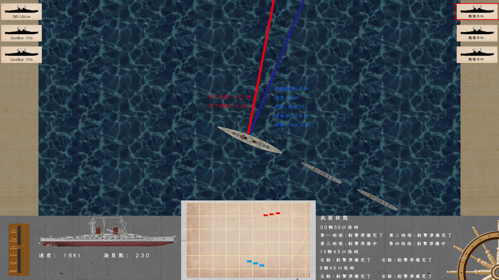

# WarshipBattle  
自主制作  

##操作説明：
-←：左に向かて行く  
-→：右に向かて行く  
-Ⅹ：舵が自動的に元に戻る  
-Ｓ：射撃  
-↑：速度ふやす  
-↓：速度減らす  
-０：テストモードオン／オフ  
-Esc:前画面に戻る/ゲーム終了  

##2019.3.29  
- [X]このプロジェクトを立案からも二か月立ちました。  
今はマウス操作できるように努めたいです。  

-ゲームとしてはやはり使いやすいことが大事です。  
-今回では就職用作品として提出とともに、ＲｅａｄＭｅを追加しました。  
-これからの更新は戦闘部分の完成に集中したいです。  
-一人だけでも最高の海戦ゲームを作りたいです。  
-よろしくお願いします。  

##
画像データ
サンプル画面
 

-本ゲームは ＤＸライブラリ を使用しています。ライセンス等はDxLib.txtを参照のこと。
